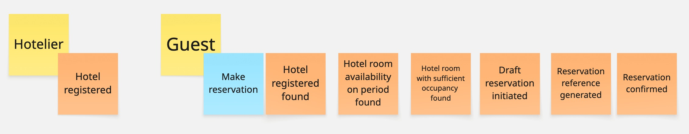

# Welcome to the reservation Kata

## Context
You recently joined a company that builds software to handle reservations for hotels. A guest wants to travel to a specific hotel. Your role is to make sure the hotel is registered in your system to confirm the reservation.

Unfortunately, this is a legacy code with a lot of logs and metrics everywhere. So, it's not easy to read and understand. But you manage to organize an event storming with a domain expert to give you the details of the business events happening during the booking process.

## Goal
One of your new teammate just read the [Domain Oriented Observability article](https://martinfowler.com/articles/domain-oriented-observability.html) on Martin's Fowler blog written by [Pete Hodgson](https://blog.thepete.net/about/).
You decide to try to implement this pattern to make the code easier to read and understand.
